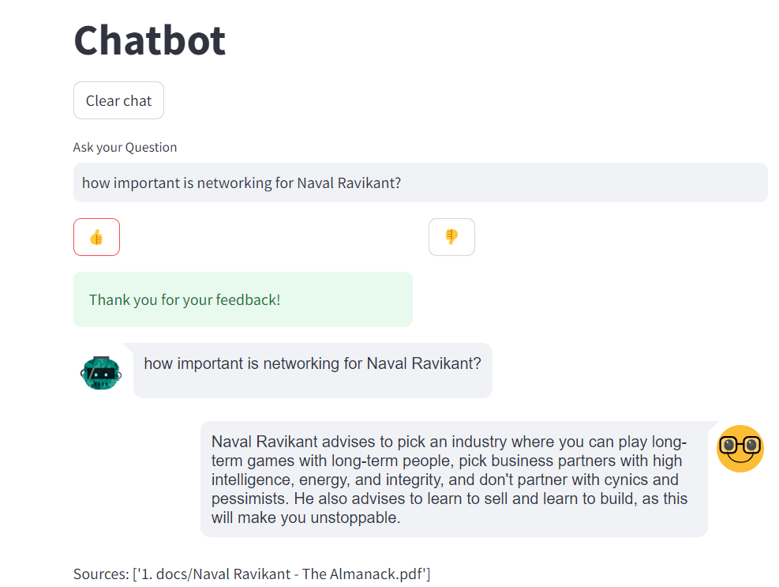

# 💁 Chatbot for Interacting with Books and Documents 📝

## Introduction

🤖 Welcome to my interactive chatbot designed for engaging with books and documents. As an example, you'll find integrated in the docs an insightful book, "The Almanack of Naval Ravikant." This chatbot leverages Streamlit for its graphical interface, Langchain for the QA mechanism, and Chroma as the vector database.



## Features

- **Dynamic Interaction**: Generates responses based on the books or documents you upload.
- **User Feedback**: Allows users to express their opinions with a thumbs up or down.
- **Feedback Storage**: Captures user feedback in a JSON file for historical analysis.
- **Source Citing**: Includes references for the information provided in the responses.

## Requirements

- An OpenAI API key with access to Large Language Models.

## Installation

1. **Clone the Repository**:

   ```
   git clone https://github.com/your-username/your-repository.git
   ```

2. **Create a Virtual Environment**:

   ```
   python -m venv .venv_chatbot
   .venv_chatbot\Scripts\activate
   ```

3. **Install Required Packages**:

   ```
   pip install -r requirements.txt
   ```

4. **Configure OpenAI API Key**:

   - Create a `.env` file in the project's root directory and add your API key.

5. **Run the Streamlit App**:
   ```
   streamlit run app.py
   ```

## Customize the Document

To test the chatbot with a personalized document, replace the files in the `docs` directory with your document.

## Usage

1. Enter your query in the input box and press enter.
2. Provide feedback on the response using the thumbs up or down buttons.
3. Review the cited sources in the chatbot's response.

## Contributions

📝 Your contributions are greatly appreciated! If you have ideas for enhancements or improvements, feel free to submit a pull request.

### Additional Notes

- Before running `streamlit run app.py`, install `chromadb`. This package may require the installation of "Microsoft C++ Build Tools" and all necessary components to compile C++ projects.
